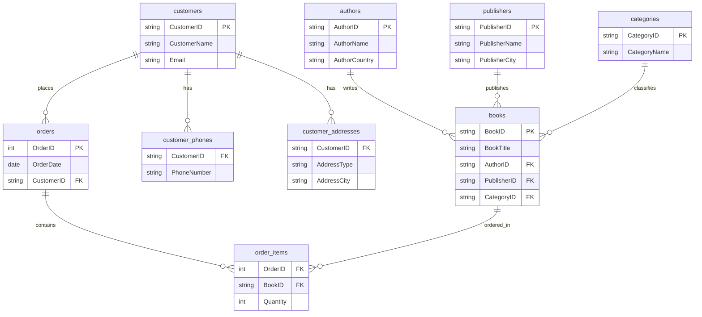

## Task 1 – Analysis

### CUSTOMER_ORDERS
**Composite PK: (OrderID, BookID)**

**Problems:**
- Repeating groups
- Partial dependencies
- Transitive dependencies
- Update anomaly
- Insert anomaly
- Delete anomaly

---

### BOOK_INVENTORY
**PK: BookID**

**Problems:**
- Partial dependencies
- Transitive dependencies
- Update anomaly
- Insert anomaly
- Delete anomaly

---

### CUSTOMER_PROFILE
**PK: CustomerID**

Neither column is atomic. The table is not in 1NF.

**Problems:**
- Partial dependencies
- Transitive dependencies
- Update anomaly
- Insert anomaly
- Delete anomaly

---

## Task 2 – Step-by-Step Normalization

### CUSTOMER_ORDERS

**Original:**
```
CUSTOMER_ORDERS (OrderID, OrderDate, CustomerID, CustomerName, CustomerEmail, BookID, BookTitle, AuthorName, PublisherName, Quantity)
PK: (OrderID, BookID)
```

**1NF** — passed

**2NF** — remove partial dependencies:
```
orders     (OrderID PK, OrderDate, CustomerID, CustomerName, CustomerEmail)
books      (BookID PK, BookTitle, AuthorName, PublisherName)
order_items (OrderID FK, BookID FK, Quantity)  PK: (OrderID, BookID)
```

**3NF** — remove transitive dependencies:
```
customers  (CustomerID PK, CustomerName, CustomerEmail)
orders     (OrderID PK, OrderDate, CustomerID FK)
order_items (OrderID FK, BookID FK, Quantity)  PK: (OrderID, BookID)
books      (BookID PK, BookTitle, AuthorID FK, PublisherID FK)
authors    (AuthorID PK, AuthorName)
publishers (PublisherID PK, PublisherName)
```

---

### BOOK_INVENTORY

**Original:**
```
BOOK_INVENTORY (BookID, BookTitle, AuthorID, AuthorName, AuthorCountry, PublisherID, PublisherName, PublisherCity, CategoryID, CategoryName)
PK: BookID
```

**1NF** — passed

**2NF** — passed

**3NF** — remove transitive dependencies:
```
books      (BookID PK, BookTitle, AuthorID FK, PublisherID FK, CategoryID FK)
authors    (AuthorID PK, AuthorName, AuthorCountry)
publishers (PublisherID PK, PublisherName, PublisherCity)
categories (CategoryID PK, CategoryName)
```

---

### CUSTOMER_PROFILE

**Original:**
```
CUSTOMER_PROFILE (CustomerID, CustomerName, Email, PhoneNumbers, Addresses)
PK: CustomerID
```

**1NF** — non-atomic values, split into separate tables:
```
customers          (CustomerID PK, CustomerName, Email)
customer_phones    (CustomerID FK, PhoneNumber)  PK: (CustomerID, PhoneNumber)
customer_addresses (CustomerID FK, AddressType, AddressCity)  PK: (CustomerID, AddressType)
```

**2NF** — passed

**3NF** — passed

---

## Task 3 – Final Normalized Database Design

| Table | Primary Key | Foreign Keys | Attributes |
|---|---|---|---|
| `customers` | CustomerID | — | CustomerName, Email |
| `customer_phones` | CustomerID + PhoneNumber | CustomerID → customers | — |
| `customer_addresses` | CustomerID + AddressType | CustomerID → customers | AddressCity |
| `orders` | OrderID | CustomerID → customers | OrderDate |
| `order_items` | OrderID + BookID | OrderID → orders, BookID → books | Quantity |
| `books` | BookID | AuthorID → authors, PublisherID → publishers, CategoryID → categories | BookTitle |
| `authors` | AuthorID | — | AuthorName, AuthorCountry |
| `publishers` | PublisherID | — | PublisherName, PublisherCity |
| `categories` | CategoryID | — | CategoryName |

---

## Task 4 – ERD



---

## Bonus Challenge – Supporting Multiple Authors per Book

| Table | Primary Key | Foreign Keys | Attributes |
|---|---|---|---|
| `books` | BookID | PublisherID → publishers, CategoryID → categories | BookTitle |
| `authors` | AuthorID | — | AuthorName, AuthorCountry |
| `book_authors` | BookID + AuthorID | BookID → books, AuthorID → authors | — |
