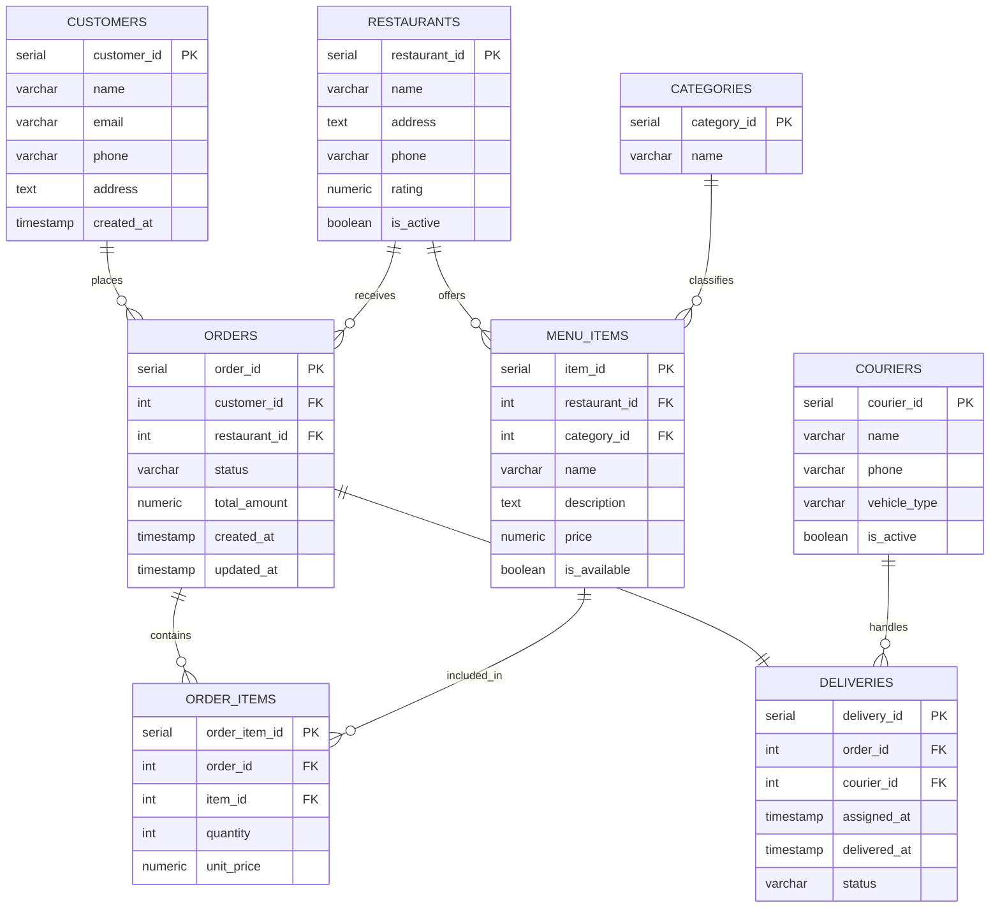

## Part 1. Business Description
 
**Domain:** Food Delivery
 
**Main users:**
- Customers — place and track orders
- Restaurants — manage menus and receive orders
- Couriers — pick up and deliver orders
  
**Supported business processes:**
- Customer and restaurant registration
- Menu browsing and order placement
- Payment processing
- Courier assignment and delivery tracking
- Ratings and feedback collection
---
 
## Part 2. Business Questions
 
**Customers / Users**
- Who are registered customers and what contact information is stored?
- How many customers placed at least one order in the last 30 days?
- Which customers generate the highest revenue?
  
**Transactions**
- What orders were placed today / within a given period?
- Who placed the order and which courier delivered it?
- What is the current status of active orders?
  
**Products / Services**
- What menu items does each restaurant offer?
- Which categories do menu items belong to?
- Which items are currently available (`is_available = TRUE`)?
  
**Operational Reporting**
- What are the most frequently ordered items?
- Which restaurants have the highest average rating?
- What is the average order value?
- What is the monthly revenue trend?
- Which couriers completed the most deliveries?
---
 
## Part 3. Data Model
 
### Tables Overview
 
| Table | Description |
|---|---|
| `customers` | Registered users who place orders |
| `restaurants` | Partner restaurants on the platform |
| `categories` | Food categories (e.g., Pizza, Sushi) |
| `menu_items` | Dishes offered by restaurants |
| `orders` | Customer orders |
| `order_items` | Bridge table resolving M:M between orders and menu items |
| `couriers` | Delivery personnel |
| `deliveries` | Delivery assignment and status tracking per order |
 
### Relationships
 
| Relationship | 
|---|
| `restaurants` → `menu_items` | 
| `categories` → `menu_items` | 
| `customers` → `orders` | 
| `restaurants` → `orders` |
| `orders` ↔ `menu_items` via `order_items` | 
| `orders` → `deliveries` | 
| `couriers` → `deliveries` | 
 
### Normalization
 
The schema is normalized to **3NF**: no partial dependencies, no transitive dependencies, all non-key attributes depend solely on the primary key of their respective table.
 
### Logical Model
 
**customers**(`customer_id` PK, `name`, `email`, `phone`, `address`, `created_at`)
 
**restaurants**(`restaurant_id` PK, `name`, `address`, `phone`, `rating`, `is_active`)
 
**categories**(`category_id` PK, `name`)
 
**menu_items**(`item_id` PK, `restaurant_id` FK, `category_id` FK, `name`, `description`, `price`, `is_available`)
 
**orders**(`order_id` PK, `customer_id` FK, `restaurant_id` FK, `status`, `total_amount`, `created_at`, `updated_at`)
 
**order_items**(`order_item_id` PK, `order_id` FK, `item_id` FK, `quantity`, `unit_price`)
 
**couriers**(`courier_id` PK, `name`, `phone`, `vehicle_type`, `is_active`)
 
**deliveries**(`delivery_id` PK, `order_id` FK, `courier_id` FK, `assigned_at`, `delivered_at`, `status`)
 
### Physical Model — Constraints
 
| Table | Notable Constraints |
|---|---|
| `customers` | `email` UNIQUE, `phone` UNIQUE |
| `restaurants` | `rating` CHECK (0.0–5.0) |
| `categories` | `name` UNIQUE |
| `menu_items` | `price` CHECK (> 0) |
| `orders` | `status` CHECK IN ('pending','confirmed','preparing','in_delivery','delivered','cancelled'), `total_amount` CHECK (> 0) |
| `order_items` | `quantity` CHECK (> 0), `unit_price` CHECK (> 0) |
| `couriers` | `vehicle_type` CHECK IN ('bike','scooter','car','foot') |
| `deliveries` | `order_id` UNIQUE (1:1 with orders), `status` CHECK IN ('assigned','picked_up','delivered','failed') |
 
---
 
## Part 4. ER Diagram
 

